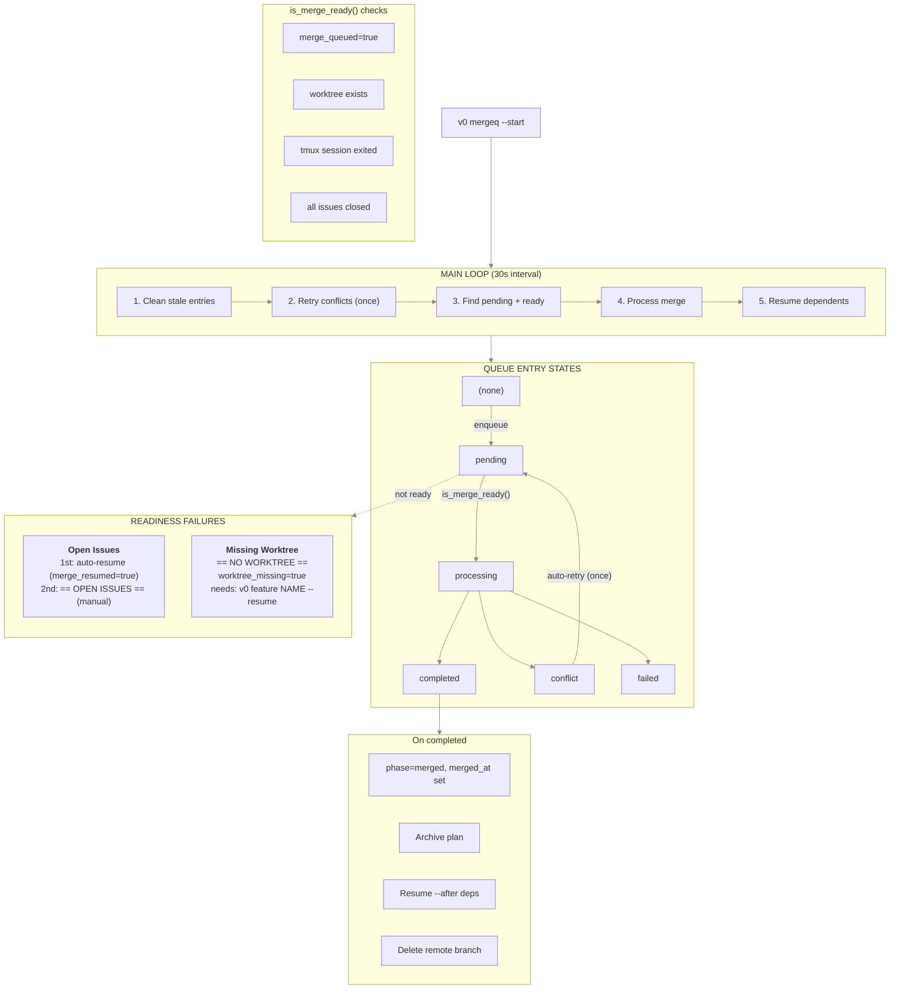

# Merge Queue Debug Guide

## State Diagram



### Readiness Check Flow

| Check | Failure | Status Icon | Recovery |
|-------|---------|-------------|----------|
| `merge_queued=true` | Not queued | — | `v0 mergeq --enqueue NAME` |
| Worktree exists | Missing | `== NO WORKTREE ==` | `v0 feature NAME --resume` |
| tmux session exited | Still running | `(active)` | Wait or detach |
| All issues closed | Open issues | `== OPEN ISSUES ==` | Close issues manually |

### State Flags

| Flag | Set When | Effect |
|------|----------|--------|
| `merge_resumed` | Auto-resume triggered once | Prevents second auto-resume; shows `== OPEN ISSUES ==` |
| `worktree_missing` | Worktree not found | Shows `== NO WORKTREE ==` in status |
| `conflict_retried` | Conflict auto-retry attempted | Prevents infinite retry loop |

## Queue File Format

Location: `BUILD_DIR/mergeq/queue.json`

```json
{
  "version": 1,
  "entries": [
    {
      "operation": "my-feature",
      "worktree": "/path/to/worktree",
      "priority": 0,
      "enqueued_at": "ISO-timestamp",
      "status": "pending|processing|completed|failed|conflict",
      "merge_type": "operation|branch",
      "issue_id": "OPTIONAL"
    }
  ]
}
```

## Quick Diagnosis

### Check daemon status
```bash
pgrep -f "v0-mergeq --watch"
tail -f BUILD_DIR/mergeq/daemon.log
```

### List queue entries
```bash
v0 mergeq --list
cat BUILD_DIR/mergeq/queue.json | jq '.entries[] | {operation, status}'
```

### Check specific entry
```bash
cat BUILD_DIR/mergeq/queue.json | jq '.entries[] | select(.operation == "{name}")'
```

### Check why entry not ready
```bash
# Worktree exists?
ls -d BUILD_DIR/worktrees/feature/{name} 2>/dev/null

# tmux session exited?
tmux ls | grep "feature-{name}"

# Issues closed?
wk ls --label "plan:{name}" --status open

# Uncommitted changes?
git -C BUILD_DIR/worktrees/feature/{name} status --porcelain
```

## Failure Recovery

### Daemon not running
```bash
# Check
pgrep -f "v0-mergeq --watch"

# Restart
v0 mergeq --start
```

### Entry stuck in `pending`

Check readiness conditions:
```bash
# Get worktree path
WORKTREE=$(cat BUILD_DIR/mergeq/queue.json | jq -r '.entries[] | select(.operation == "{name}") | .worktree')

# Check each condition
[ -d "$WORKTREE" ] && echo "Worktree exists" || echo "MISSING WORKTREE"
tmux has-session -t "{project}-feature-{name}" 2>/dev/null && echo "tmux still running" || echo "tmux exited"
wk ls --label "plan:{name}" --status open
git -C "$WORKTREE" status --porcelain
```

### Entry in `conflict`
```bash
# Resolve conflicts manually
cd BUILD_DIR/worktrees/feature/{name}
git status
# ... resolve ...
git add . && git commit

# Force reprocess
v0 mergeq --retry {name}
```

### Entry in `failed` (worktree deleted)
```bash
# Check if branch still exists on remote
git ls-remote origin feature/{name}

# Option 1: Recreate worktree
git worktree add BUILD_DIR/worktrees/feature/{name} origin/feature/{name}
v0 mergeq --enqueue {name}

# Option 2: Manual merge from remote
git checkout main
git merge origin/feature/{name}
git push origin main
```

### Queue lock stuck
```bash
# Check for lock
ls BUILD_DIR/mergeq/.queue.lock

# Remove if stale (check no daemon running first)
pgrep -f "v0-mergeq" || rm BUILD_DIR/mergeq/.queue.lock
```

### Merge lock stuck
```bash
# Check for lock
ls BUILD_DIR/.merge.lock

# Remove if stale
rm BUILD_DIR/.merge.lock
```

## Source Files

- `bin/v0-mergeq:521-552` — Readiness checks (`is_merge_ready`)
- `bin/v0-mergeq:820-980` — Merge processing (`process_merge`)
- `bin/v0-mergeq:983-1135` — Daemon loop (`process_watch`)
- `bin/v0-mergeq:1070-1116` — Open issues / worktree missing handling
- `lib/state-machine.sh:953-1041` — Status display formatting (`_sm_format_phase_display`)
